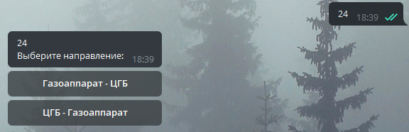
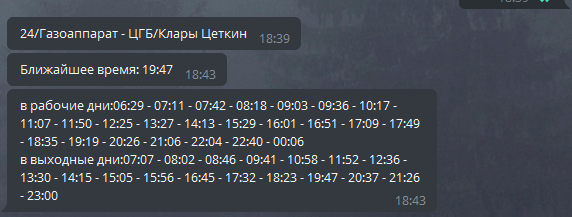
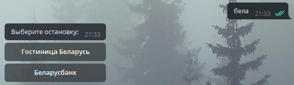
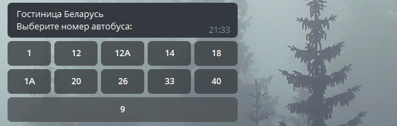
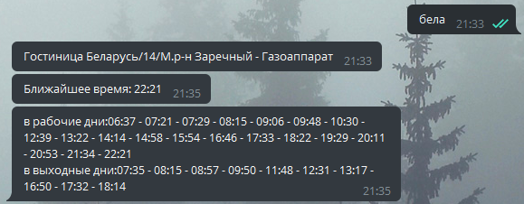

# It was a mistake to cum here
### ***This program of a Telegram bot that can give a user schedule of Buses*** ###
- User send in message some number of route:

- Then user recieve 2 buttons with directions of this route then user decide:

- Then user recieve n button of stops:

- And then he recieves nearest time on this stop and all time in weekdays and weekends:

### Or ###
#### ¿noʎ ʇ,uǝʌɐɥ 'ǝʇɐɟ ǝןqıɹɹǝʇ ɐ ɥʇıʍ ʇǝɯ ǝʌ,noʎ ####

- User send some part of name of busstop

- User recieve n stops that are similar to pattern that user had written

- User recieve n numbers that run at these stops

- User choose one or two directions

- And finally get time

